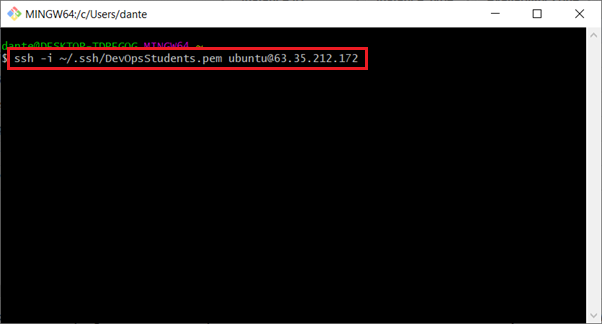
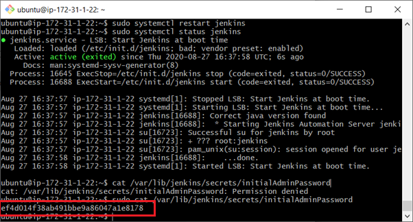
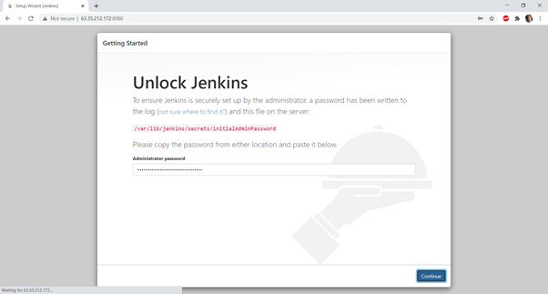
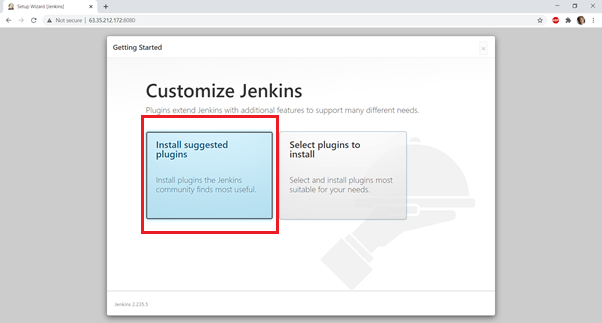
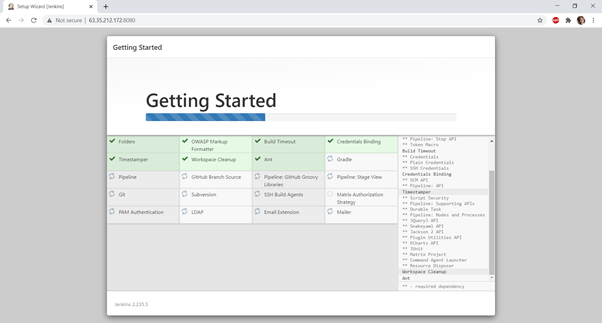

# Set up instance

# make provision file


# Notes


### Insalling Jenkins on a EC2 instance.

##### First we must spin up a EC2 intances on AWS (T2-Micro). This will be our main jenkins instance. Set the security group inbound rules as follows (We will make adjustments to this later.


##### Now We can spin up a 2nd EC2 instance. This will be the secondary Jenkins instance. Se the inbound rules as follows. (Agin we will make changes to this later)


##### Now we can SSH into the first main Instance (1st). Use the public IP address. This is where we will install Jenkins.



##### In order now paste these commands into the VM.
```
wget -q -O - https://pkg.jenkins.io/debian/jenkins-ci.org.key | sudo apt-key add –
```
```
echo deb https://pkg.jenkins.io/debian-stable binary/ | sudo tee /etc/apt/sources.list.d/jenkins.list
```
```
sudo apt-get update
```
```
sudo apt-get install Jenkins
```

##### If an error occurs when performing the last command you can try and paste the following command and then try reinstalling Jenkins

```
sudo apt install openjdk-8-jre
```
```
sudo apt-get update
```
```
sudo systemctl start Jenkins
```
##### Now lets see if Jenkins is running

```
sudo systemctl status Jenkins
```
##### It should say that Jenkins is active like below:


##### Now when you visit the main Instances public IP adress you should be able to access the following webpage. Note I was not able to access the page at first. I had to edit the inbound rules of the main Instance to allow for all tracffic on port 8080.


##### Now we need to get the Admin password. Go bac onto the git bash terminal and paste the following command:
```
cat /var/lib/jenkins/secrets/initialAdminPassword
```
##### Once pasted inside the terminal the password should appear as seen below:



##### Now go back to the Jenkins web page and enter in the password



##### From here now select Install suggested plugins



##### Now wait for it to install the plugins



##### You should be prompted to create a user like below. Enter the details that you would like to use and click save and continue


# Install the dependencies (format this*) 

1) download jenkins using recommended settings

2) enter details http://34.243.215.99:8080/

4) 
3) In the worker vm paste this
``` 
ssh -i ~/.ssh/DevOpsStudents.pem ubuntu@34.242.116.0
java -jar agent.jar -jnlpUrl http://34.243.215.99:8080/computer/Eng67.Man-Wai.Worker.Node/slave-agent.jnlp -secret da74ace56e42d38af836411ad5c4efb7fc4b5e861c2f14fdc963e57108ca1cb5 -workDir "/opt/jenkins"
```

#testing integration

# Update docker privilegdes before delivery
sudo usermod -aG docker ${USER}
newgrp docker
sudo service docker restart
sudo systemctl restart docker
sudo chmod 666 /var/run/docker.sock

download the pipline plugin!

test
